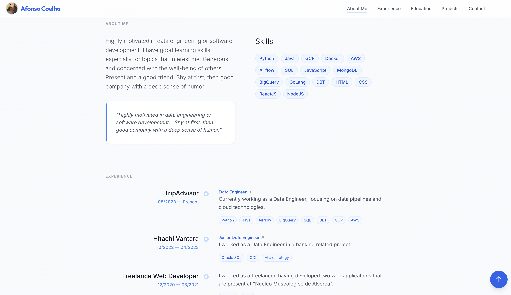

<div align="center">

# Afonso Benedito

### {Data, Software} Engineer

[](https://afonsobenedito.com)

[](https://www.linkedin.com/in/afonsobenedito/)
[](https://github.com/AfonsoBenedito)
[](mailto:afonso.benedito23@gmail.com)

<br />


<br />

*Data Engineer @ TripAdvisor*

---



</div>

<br />

## About

Personal portfolio website showcasing my work, skills, and professional journey. Built as a responsive single-page application with smooth animations, scroll-spy navigation, and a clean, modern design.

<br />

## Tech Stack

<div align="center">


</div>

<br />

## Features

- **Responsive Design** — Mobile-first layout with smooth breakpoints across all devices
- **Scroll Animations** — Sections fade in using Intersection Observer as you scroll
- **Scroll-Spy Navigation** — Active section highlighted in the header as you browse
- **Lazy Loading** — Route-level code splitting with React Suspense for fast initial load
- **Contact Integration** — Direct email via EmailJS without a backend
- **SEO Optimized** — Open Graph meta tags, JSON-LD structured data, and custom domain

<br />

## Sections

| Section | Description |
|---------|-------------|
| **Hero** | Welcome message with profile photo and animated introduction |
| **About** | Personal description, skills (Python, Java, GCP, AWS, ...), and interests |
| **Experience** | Work history timeline — Freelancer, Hitachi Vantara, TripAdvisor |
| **Education** | BSc in Computer Science (ULisboa) and AWS certifications |
| **Projects** | College and personal projects with live demos and screenshots |
| **Contact** | Email form and social media links |

<br />

## Getting Started

**Prerequisites:** [Node.js](https://nodejs.org/) (v18+)

```bash
# Clone the repository
git clone https://github.com/afonsobenedito/afonso-benedito.git
cd afonso-benedito

# Install dependencies & start dev server
npm run dev
```

Open [http://localhost:5173/afonso-benedito/](http://localhost:5173/afonso-benedito/) in your browser.

<br />

## Deployment

Deployed on **GitHub Pages** with a custom domain.

```bash
npm run deploy
```

<br />

<div align="center">

---

Made with :blue_heart: by [Afonso Benedito](https://afonsobenedito.com)

</div>
